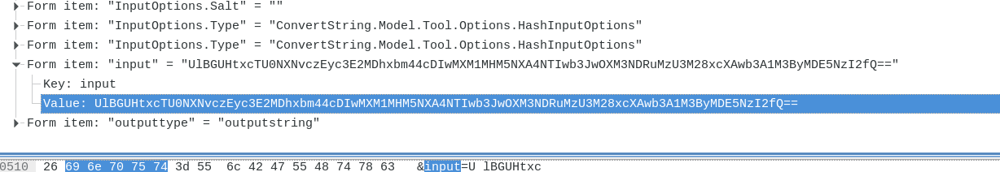

# ECSC 2019
**Author: Feraru Mihail - mihailferaru2000@gmail.com - littlewho**

## Online Encryption (100): Forensics

### Proof of flag
```
ECSC{dd545fbf12fd608daa8c201f50f95c8520bec9f744a3573b1dc0bc53ce019726}
```

### Summary
Looking trough the PCAP file we see that the user tried to hash some text with an online MD5 application. 

### Proof of solving
Idenify the packet:

Get the content:

Decode using base64.
