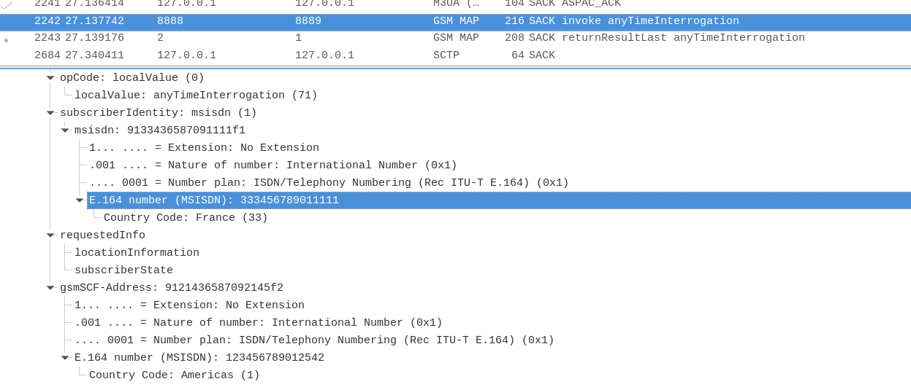
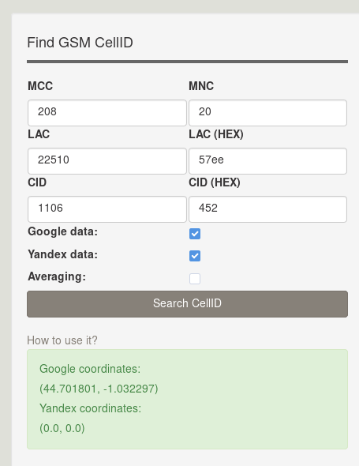
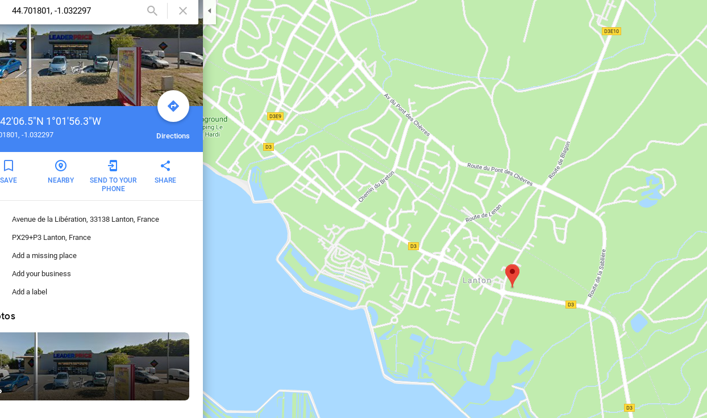

# ECSC 2019
**Author: Feraru Mihail - mihailferaru2000@gmail.com - littlewho**

## global-cell (300): Network

### Proof of flag
```
ECSC{50FB4A9BEE63B51141C2B32E42251D1F88104731D1A7B73FF9750626227D7F5A}
```

### Summary
Looking at the PCAP we see 2 types of signifiant traffic:
* TCP - mostly MySQL
* Mutiple GSM protocols
Dumping the strings from the file we are able to find a security audit paper. It explains common terms and vulnerabilities. After understanding the basic concepts, we can assume that we have a network capture of a MSC (mobile switching center) internal network. As we see in the paper it should mean that we could leak the location of physical devices by using the MSISDN and other data.

### Proof of solving
First, I filtered out all the TCP traffic. Then I inspected each GSM packet and the following one was the most interesting:

We could assume that there is an ongoing interaction between a phone in France and one in Americas. Searching for "americas" in the file returned no results, but for the other one, things became more interesting:
```
: 123456789012542\nPerimeter: international:SIGTRAN\nID: 37\nName: SIGTRAN MODULES TEST\n\n==== HLR ====\nMSISDN used by PTA: 333456789011111\nGSMSCF used by PTA: 123456789012542\nHLR discovered: 333456789011111 (France, Olo Zone 3)', '2018-10-11 15:54:58', '2018-10-11 15:54:58')
```
**Olo zones** are referring to zones of different call rates depending on geographical location. It means that the location of this phone is leaked somewhere. After some more "grep"-ing, I leaked the following information:
```
MSISDN: 333456789011111
MSC-GT: 33212000167
Country code: 33
MCC: 208
MNC: 20
LAC: 22510
cell_id: 1106
gcell_id: 208f2075ee4025
```
According to the research paper found in the dump, this must be enough for identifying the location of the user. I used this online service `https://cellidfinder.com/`








So, the city where the call was made is Lanton and it's area code is `33229`.
