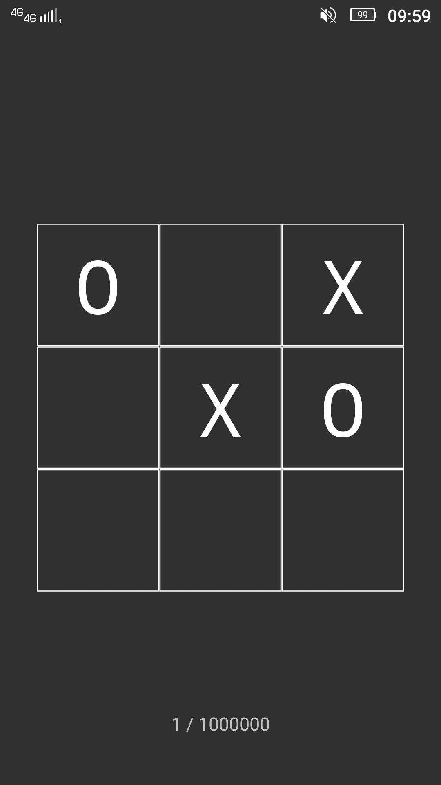
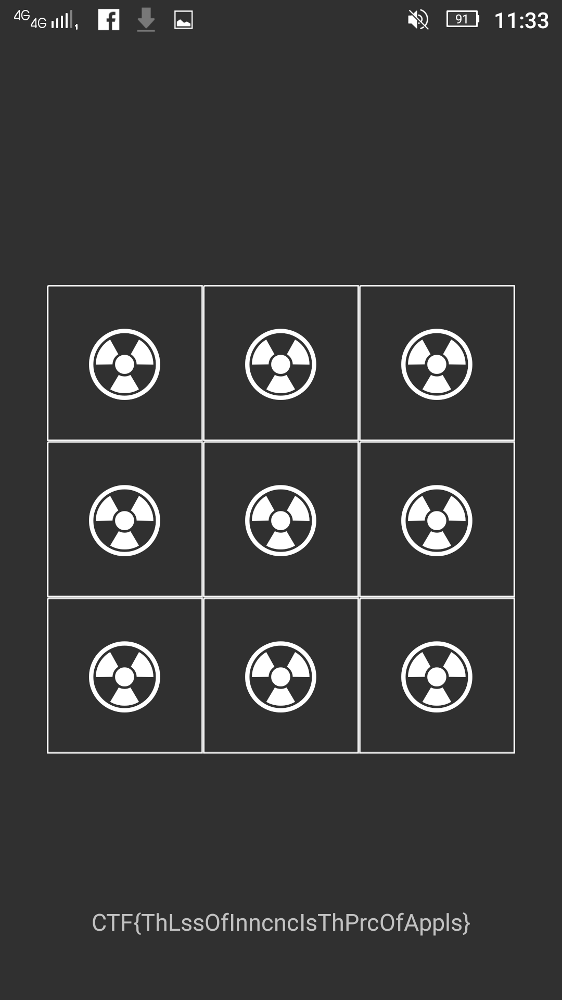

Shall we play a game?
===

The challenge is pretty straightforward, but a write-up could be appreciated by some people too, so let's go. We have an APK file and a simple description: "Win the game 1,000,000 times to get the flag.". 

OK, so we should run this app somehow, the simplest way is to install it on an Android phone, but maybe you haven't one (Google it's up upset on you now :disappointed:), so I will list some other possibilities:
* Bluestacks/Genymotion Emulator
* QEMU-arm
* Shashlik
* ARC Welder on Google Chrome

Some of them could be real struggle to configure on some systems. In my case I have a Genymotion Emulator configured and an Android phone. 

NOTE: On most devices/emulators we will need to sign the APK in order to install it. We can use ZipSigner from Google Play or generate manually a key and sign with something like jarsigner or apktool.



So, we have a Tic-Tac-Toe game and we need to win it 1 million times. If you are a pro player I think you could give it a try, but let's have a different approach here. Probably there is some counter for the won games, we could modify the app to increase it by a big number and win in only one round.

Hoping that there are no obfuscation techniques or anything like that, let's try to get the source code using a great online Java decompiler I like to use: http://www.javadecompilers.com/apk . After exploring a little bit, we see that the interesting things for us are in  `app/com/google/ctf/shallweplayagame/`:
```bash
[littlewho@sweetHome google2018quals]$ ls app/com/google/ctf/shallweplayagame/
C0644N.java  C0649a.java  C0652b.java  GameActivity.java
```

`GameActivity.java` seems to be the most obvious place where all the events happen. In the method `public void onClick(View view)` we can see checkings for X won, draw or O won. The method that is called when X wins, it's the following (I added few comments to explain things):
```java
    void m3215n() {
        // empty the board
        for (int i = 0; i < 3; i++) {
            for (int i2 = 0; i2 < 3; i2++) {
                this.f2327l[i2][i].m3222a(C0648a.EMPTY, 25);
            }
        }
        // play the animations
        m3212k();

        // our wins counter
        this.f2330o++;
        // some strange calculations on the flag probably
        Object _ = C0644N.m3217_(Integer.valueOf(2), C0644N.f2338e, Integer.valueOf(2));
        C0644N.m3217_(Integer.valueOf(2), C0644N.f2339f, _, this.f2332q);
        this.f2332q = (byte[]) C0644N.m3217_(Integer.valueOf(2), C0644N.f2340g, _);
        if (this.f2330o == 1000000) {
            m3214m(); // show the flag
            return;
        }
        // update the score table
        ((TextView) findViewById(R.id.score)).setText(String.format("%d / %d", new Object[]{Integer.valueOf(this.f2330o), Integer.valueOf(1000000)}));
    }
```

I think that if we simply modify the wins counter by 1 million, we've got the flag. But we can't just modify this code and recompile, we'll need to use apktool to decompile to Java opcodes, change the opcode and build again.
```bash
[littlewho@sweetHome google2018quals]$ apktool d app.apk -o app_opcodes
I: Using Apktool 2.3.3 on app.apk
I: Loading resource table...
I: Decoding AndroidManifest.xml with resources...
S: WARNING: Could not write to (/home/littlewho/.local/share/apktool/framework), using /tmp instead...
S: Please be aware this is a volatile directory and frameworks could go missing, please utilize --frame-path if the default storage directory is unavailable
I: Loading resource table from file: /tmp/1.apk
I: Regular manifest package...
I: Decoding file-resources...
I: Decoding values */* XMLs...
I: Baksmaling classes.dex...
I: Copying assets and libs...
I: Copying unknown files...
I: Copying original files...
```

The files of interest will be almost in the same path (`app_opcodes/smali/com/google/ctf/shallweplayagame`), but this time we see that their extension is `smali`. `smali` it's the intermediary format for Java `dex` (dalvik executables) files. A good reference for the opcodes is here http://pallergabor.uw.hu/androidblog/dalvik_opcodes.html

`onClick` method is still here, but it looks a lot more different. If we take a closer look, we can see the same elements,  we have conditions:
```
902| if-eqz v0, :cond_0
889| if-eqz v0, :cond_1
...
944| if-eqz v1, :cond_4
...
```
method calls and variables (you won't see variables as usual, instead it uses `vXX` registers to manipulate instances addresses, values and so on):
```
896|    iget-object v0, p0, Lcom/google/ctf/shallweplayagame/GameActivity;->m:Ljava/util/Queue; // get an object refernce into the v0 register
897|
898|    invoke-interface {v0}, Ljava/util/Queue;->isEmpty()Z // call the method isEmpty on it
899|
900|    move-result v0 // get the result
...
```

If we take a look at the Java source code, we see that after the third condition we have a call to the method that increment the winning conter, so it should be the third condition in the `smali` too.
```
931| invoke-virtual {p0}, Lcom/google/ctf/shallweplayagame/GameActivity;->n()V // p0 is the first parameter of current method, in this case, 'this' reference
```
And looking at this method, we see the value `0xf4240` stored as a constant and that's 1 million in decimal, so we are in the right place.
```
.method n()V
    .locals 10

    const v9, 0xf4240

    const/4 v8, 0x1

    const/4 v7, 0x3

    const/4 v1, 0x0

    const/4 v6, 0x2

    move v2, v1
    ...
```
After those declarations, we have the code for the first two nested loops:
```
    :goto_0
    if-ge v2, v7, :cond_1

    move v0, v1

    :goto_1
    if-ge v0, v7, :cond_0

    iget-object v3, p0, Lcom/google/ctf/shallweplayagame/GameActivity;->l:[[Lcom/google/ctf/shallweplayagame/a;

    aget-object v3, v3, v0

    aget-object v3, v3, v2

    sget-object v4, Lcom/google/ctf/shallweplayagame/a$a;->a:Lcom/google/ctf/shallweplayagame/a$a;

    const/16 v5, 0x19

    invoke-virtual {v3, v4, v5}, Lcom/google/ctf/shallweplayagame/a;->a(Lcom/google/ctf/shallweplayagame/a$a;I)V

    add-int/lit8 v0, v0, 0x1

    goto :goto_1

    :cond_0
    add-int/lit8 v0, v2, 0x1

    move v2, v0

    goto :goto_0
```
Then, the magic begins here:
```
    :cond_1
    // play animations, sounds, etc
    invoke-virtual {p0}, Lcom/google/ctf/shallweplayagame/GameActivity;->k()V

    // get the reference to the winning counter and increase its value by 1
    iget v0, p0, Lcom/google/ctf/shallweplayagame/GameActivity;->o:I

    add-int/lit8 v0, v0, 0x1

    ... some strange calculations on the flag I think ...

    // get the reference again
    iget v0, p0, Lcom/google/ctf/shallweplayagame/GameActivity;->o:I

    // compare the counter with v9 (1 million constant)
    if-ne v0, v9, :cond_2

    // call the method that display the flag
    invoke-virtual {p0}, Lcom/google/ctf/shallweplayagame/GameActivity;->m()V
```
We could try to change the incrementation from 0x1 to 0xf4240 and win, but if we read the opcode docs for `add-int/lit8` we see that it won't support such a great value. In that case we could create a constant and move it to the counter, or use another `add-int` instruction that supports greater values, or we could use a loop, etc, but there are other calculations made with the flag that are probably decryption operations, as it would be too easy if the flag was in plain text in memory. So, let's make a loop that includes the flag calculations too, but before that we need to figure out how to use registers as our variables, how to perform comparasions and how to increment values. For that we can take a look at the Dalvik opcodes documentation (you have a link earlier in this doc) and the actual opcode of the game.

Firstly, at the beginning of the method we see the statement `.locals 10`, this tells the compiler how many registers should reserve for this method. We'll need 1 more register for storing another counter, so let's change from `.locals 10` to `.locals 11`. 

Secondly, let's study the docs a little bit and we will know that we need the folling opcodes to do our job:
* `move <to>, <from>` - move the value stored in register <from> to <to>, simple; we will use this to get the 0 constant into our counter
* `add-int/lit8 <to>, <arg1>, <arg2>` - as mentioned earlier, it's an addition instruction, it adds the 8-bit literal value <arg2> to value from register <arg1> and stores the result in <to>
* `if-ne <arg1>, <arg2>, <label>` - conditional instruction, if <arg1> is not equal with <arg2>, jump to the <label>
    
    
And the code:
```
    .locals 11 
    
    ... not relevant code ...

    move v10, v1 
    // v1 stores the constant value 0 as you can see at the beginning of the method
    // so we move it into our counter

    // --- loop start ---
    :cond_10 // label for our loop

    // we put our loop start before the incrementation of winning counter
    // note that we did not include the call to animation/sound play as it would take too long
    // and maybe it will burn your phone :P
    iget v0, p0, Lcom/google/ctf/shallweplayagame/GameActivity;->o:I
    
    // increment our counter too
    add-int/lit8 v10, v10, 0x1

    add-int/lit8 v0, v0, 0x1

    ... other actions performed on the flag ...

    // just before the comparasion between counter and 1 million we put our jump to loop start
    if-ne v10, v9, :cond_10
    // --- loop end ---

    // comparasion of the counter and the rest of code
    iget v0, p0, Lcom/google/ctf/shallweplayagame/GameActivity;->o:I

    if-ne v0, v9, :cond_2

    invoke-virtual {p0}, Lcom/google/ctf/shallweplayagame/GameActivity;->m()V
    ...
```
We could use the winning counter for our loop too, but I prefered to have my own variable for that. Now, save the file and let's build the APK:
```bash
[littlewho@sweetHome google2018quals]$ apktool b app_opcodes -o hacked.apk
I: Using Apktool 2.3.3
I: Checking whether sources has changed...
I: Smaling smali folder into classes.dex...
I: Checking whether resources has changed...
I: Building resources...
S: WARNING: Could not write to (/home/littlewho/.local/share/apktool/framework), using /tmp instead...
S: Please be aware this is a volatile directory and frameworks could go missing, please utilize --frame-path if the default storage directory is unavailable
I: Copying libs... (/lib)
I: Building apk file...
I: Copying unknown files/dir...
I: Built apk...
[littlewho@sweetHome google2018quals]$ apktool b app_opcodes -o hacked.apk
I: Using Apktool 2.3.3
I: Checking whether sources has changed...
I: Smaling smali folder into classes.dex...
I: Checking whether resources has changed...
I: Building apk file...
I: Copying unknown files/dir...
I: Built apk...
```
OK, let's run. I beaten the computer one time and it just freezed, I think it is inside the loop and our flag is being decrypted.
It's running, let's wait, running..... running... wait... OK, wait..... wait...... Oh, it's done! It took about two minutes on my phone, so be patient.


Dear ladies and gentelmen, the flag is: `CTF{ThLssOfInncncIsThPrcOfAppls}`

*Ba dum tss!*
